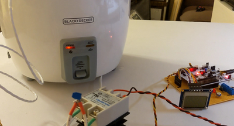
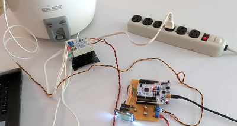
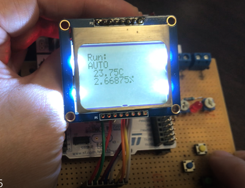
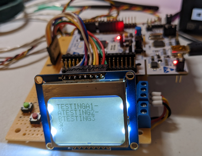
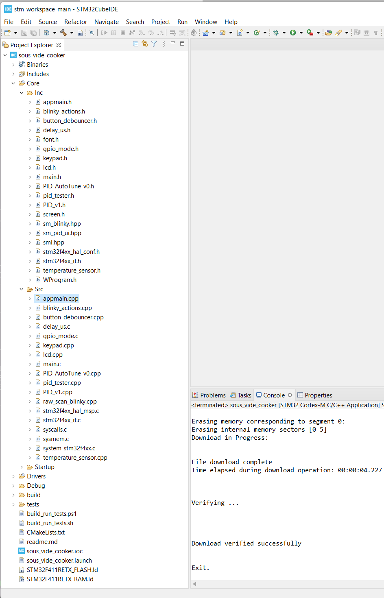
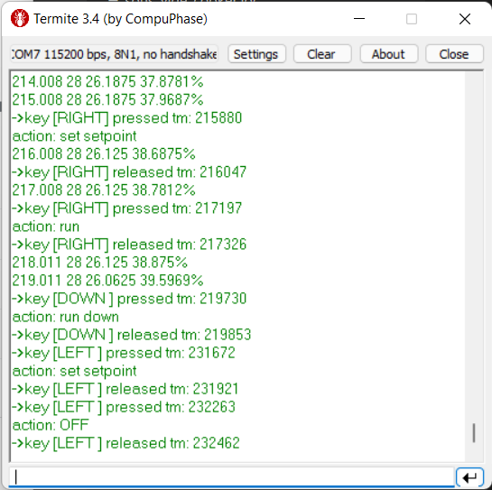

## Sous Vide Controller





[**Sous Vide Cooking**](https://en.wikipedia.org/wiki/Sous_vide) is characterized by low-temperature cooking, a longer period of cooking than conventional cooking. 

This project is attempt to create a system for this culinary technique. It is heavily inspired by similiar Adafruit project
[The SousViduino](https://learn.adafruit.com/sous-vide-powered-by-arduino-the-sous-viduino).


## Hardware description
Closed loop system driving [rice cooker](https://www.amazon.com/gp/product/B00197TJ3C). Temperature value provided by [High Temp Waterproof DS18B20 Digital temperature sensor](https://www.adafruit.com/product/642]) placed inside the cooker pot is processed by the PID algorithm run on a controller built around [STM32 Nucleo-64 development board](https://www.st.com/en/evaluation-tools/nucleo-f411re.html). 

This board features STM32F411RE Cortex-M4 MCU.
Output from the board controls LED indicator and [solid state relay](https://www.amazon.com/gp/product/B01MCWO35P) which swiches power to the cooker heating element. 

User interaction is provided by the keypad with four keys ([UP], [DOWN], [RIGHT], [LEFT]) Available as well is extra BLUE user button capable of generating external interrupt. 
Information is provided to user by the retro style [Nokia 5110 monochrome LCD](https://www.adafruit.com/product/338) and through USART which can be directly connected to the PC because board has USB-to-serial bridge.

```

                             ┌──────────────────────────────┐
                             │                              │
                             │                              │
                             │                              │
                             │                              │
                             │                    ┌─────────┼──┐   SERIAL PROTOCOL  ┌────────┐
                             │                    │         │  │                    │        │                       TO PC
                             │                    │   USART2│  ├────────────────────► USB   ─┼────────────────────────────
                             │                    │         │  │                    │ BRIDGE │
                             │                    │         │  ◄────────────────────┤        │
                             │                    └─────────┼──┘                    └────────┘
                             │                              │
                             │                              │
                             │                              │                      ┌─────────────────────────┐
                             │                              │   SPI(MASTER ONLY)   │                         │
                             │               PC_10/SPI3_SCLK├──────────────────────►SCLK                     │
                             │                              │                      │                         │
                             │                    PC_12/MOSI├──────────────────────►MOSI                     │
                             │                              │                      │            LCD          │
       ┌────┐                │                         PC_11├──────────────────────►DC                       │
       │ UP ├────────────────►PC_0                          │                      │          SCREEN         │
       └────┘                │                          PD_2├──────────────────────►SCE                      │
┌─────┐        ┌─────┐       │                              │                      │                         │
│LEFT │        │RIGHT├───────►PC_5                     PB_14├──────────────────────►RST                      │
└──┬──┘        └─────┘       │                              │                      │                         │
   │   ┌────┐                │                   PA_0/PWM2/1├──────────────────────►BACKLIGHT                │
   │   │DOWN├────────────────►PC_1                          │        PWM           │                         │
   │   └────┘                │                              │                      └─────────────────────────┘
   │                         │                              │
   │                         │                              │
   └─────────────────────────►PC_4                          │     ┌──────────────┐  ┌──────────────────────────┐
                             │                              │     │              │  │                          │
                             │                              │ PWM │     SOLID    │  │  ┌──────────┐            │
                             │                   PC_8/PWM3/3├─┬───►     STATE    ├──┼──► HEATER   │            │
     ┌─────────┐             │                              │ │   │     RELAY    │  │  │          │            │
     │         │             │                              │ │   │              │  │  └──────────┘            │
     │  BLUE   │             │                              │ │   └──────────────┘  │                          │
     │  USER   ├─────────────►PC_12/EXT INT                 │ │                     │                          │
     │   BTN   │             │                              │ │                     │          COOKER          │
     │         │             │                              │ │   ┌─────────┐       │                          │
     └─────────┘             │                              │ └───► RED LED │       │                          │
                             │                              │     └─────────┘       │                          │
                             │                              │                       │           ┌──────────────┼───────┐
                             │                              │                       │           │  TEMPERATURE │       │
                             │                              │                       │           │  SENSOR      │ DATA  ├─►┐
                             │                              │                       │           │              │       │  │
                             │                              │     ┌──────┐          │           └──────────────┼───────┘  │
                    ┌────────►PB_2                          │     │GREEN │          │                          │          │
                    │        │                          PA_5├─────► LED  │          └──────────────────────────┘          │
                    │        │                              │     └──────┘                                                │
                    │        │                              │                                                             │
                    │        │                              │                                                             │
                    │        │                              │                                                             │
                    │        └──────────────────────────────┘                                                             │
                    │                                                                                                     │
                    │                                                          ONE WIRE PROTOCOL                          │
                    └─────────────────────────────────────────────────────────────────────────────────────────────────────┘


```
## Software description 
Software was written using STM32CubeIDE which currently uses arm-none-eabi gcc toolchain 10.2.1



```
arm-none-eabi-g++ --version
arm-none-eabi-g++.exe (GNU Arm Embedded Toolchain 10-2020-q4-major) 10.2.1 20201103 (release)
Copyright (C) 2020 Free Software Foundation, Inc.
This is free software; see the source for copying conditions.  There is NO
warranty; not even for MERCHANTABILITY or FITNESS FOR A PARTICULAR PURPOSE.
```


Its C++ compiler supports C++17 features if enabled.
State machine library [SML](https://github.com/boost-ext/sml)  used here requires at least C++14 features.

---

**button_debouncer.cpp**

**keypad.cpp**

contain logic for debouncing keyboard and generating keyboard events

```
	// any events (pressed/released) from keypad
		KeyPadEvent ev;
		bool has_event = keys.get_next_event(&ev);
		if (has_event)
		{
			std::cout << "->key " << ev.to_debug_string() << std::endl;

			// pres buttons are sent to state machine for action
		 	if (ev.evt == BUTTON_PRESSED)
			{

		 		switch (int(ev.key))
		 		{
		 			case keypad::KEY_RIGHT:
		 				sm.process_event(key_right{});
		 				break;

		 			case keypad::KEY_LEFT:
		 				sm.process_event(key_left{});
		 				break;
```

Keypad is scanned periodically each 1ms by the Timer 11 interrupt handler. 

After debouncing individual keys using running count in a circular buffer BUTTON_PRESSED, BUTTON_RELEASED are generated and pushed into circular event queue.


Another type of event can be generated by user button on interrupt handler.

In between events CPU can go to sleep using 

```
		HAL_PWR_EnterSLEEPMode (
					PWR_LOWPOWERREGULATOR_ON,
					PWR_SLEEPENTRY_WFI);
```

CPU will wake up every 1 ms to check on the event queue and then goes back to sleep. Interrupt driven single button guarantees system to wake up if put into hibernation (not implemented yet)

---


**appmain.cpp**
contains main logic by importing state machine logic from **sm_pi_ui.hpp**

```
struct state_machine_pid_ui {
  auto operator()() const {

    using namespace sml;
    return make_transition_table(

		*"OFF"_s + event<key_right> = "SETPOINT"_s
		,"SETPOINT"_s + event<key_right> = "RUN"_s
		,"RUN"_s + event<key_right> = "TUNE_P"_s
		,"TUNE_P"_s + event<key_right> = "TUNE_I"_s
		,"TUNE_I"_s + event<key_right> = "TUNE_D"_s

		,"SETPOINT"_s + event<key_left> = "OFF"_s
		,"RUN"_s + event<key_left> = "SETPOINT"_s
		,"TUNE_P"_s + event<key_left> = "RUN"_s
		,"TUNE_I"_s + event<key_left> = "TUNE_P"_s
		,"TUNE_D"_s + event<key_left> = "TUNE_I"_s

		,"OFF"_s + sml::on_entry<_> / show_off_screen
		,"SETPOINT"_s + sml::on_entry<_> / show_setpoint_screen
		,"RUN"_s + sml::on_entry<_> / show_run_screen

		,"TUNE_P"_s + sml::on_entry<_> / show_P_screen
		,"TUNE_I"_s + sml::on_entry<_> / show_I_screen
		,"TUNE_D"_s + sml::on_entry<_> / show_D_screen

		,"SETPOINT"_s + event<key_up> / setpoint_up
		,"SETPOINT"_s + event<key_down> / setpoint_down

		,"RUN"_s + event<key_up> / run_up
		,"RUN"_s + event<key_down> / run_down

		,"TUNE_P"_s + event<key_up> / kp_up
		,"TUNE_P"_s + event<key_down> / kp_down

		,"TUNE_I"_s + event<key_up> / ki_up
		,"TUNE_I"_s + event<key_down> / ki_down

		,"TUNE_D"_s + event<key_up> / kd_up
		,"TUNE_D"_s + event<key_down> / kd_down


//      ,"timed "_s + event<timeout> / turn_off = X
    );
  }
};
```
Timeout events are not implemented yet. They could be useful in putting system into hibernation. By turning off GPIO
and timers one could expect it could last on battery for days until it wakes up from the button interrupt.
This will be area of next stage development.


Besides of state machine driven UI there is another algorithm running as well. It is PID controller routine. See **appmain.cpp** for details.

It uses input provided by the temperature sensor temperature_sensor.cpp and drives solid state relay using PWM input of the Timer 3.

---

**temperature_sensor.cpp**

implements bit banged version of the one wire protocol using TIM10 for microsecond timing
Since we have only one sensor I did not try to implement/use advanced features like sensor identification.

---
**lcd.cpp**

implements driver for the LCD screen. It is built out around the master only SPI protocol run by CPU built in peripheral system and toggling GPIO pins to reset, enable/disable LCD driver chip, switch between data/command mode.

I tried to use PWM mode to drive backlight pin of the LCD screen with no success (random flashes). My understanding is the chip generates power/voltage for backlight internally. GPIO pin now just turns backlight on/off.

---
**PID routines**

**Arduino libraries by Brett Beauregard**

**PID_v1/PID_Autotune_v0 {.h/.cpp}** 


are used without modification.
These needed to implement WProgram.h header and provide them unsigned long millis() counting miliseconds since system boot.

Input of the controller is temperature inside of the cooker in Celsius.
Output of the PID controler is restricted to values between 0 and 100 and expresed as duty cycle % of the cooker PWM pin. This pin drives solid state relay switching power to the cooker heating element.

---
**USART**
Simple _write implementation sending all characters to USART2 redirects stdout to the serial port.
see in **main.c**
```
int _write(int file, char *ptr, int len)
{
	if (serial_console)
		HAL_UART_Transmit(&huart2, (uint8_t*)ptr, len, HAL_MAX_DELAY);
	return len;
}
```
---
Subdirectory **tests** 

has cmake managed infrastructure for testing Core routines outside of the system. Plan was to test state machine and run these tests on the host machine.
It should work for gcc and MSVC however turns out Microsoft C++ compiler does not have the same features. Instead of using literal _s for states as "my_state"_s one has to write state<my_state>.

## Production ready development.
This controler needs improved battery management (hibernation mode), better screens.
It needs EEPROM to store PID parameters or at least its emulation.

## Battery
In hibernation one could expect the controller to stay ready on battery power for several weeks.


## Debugging / testing 
As a very first thing I redirected standard library _write_ to USART. This board has serial to USB bridge. All standard library output shows as text on my serial terminal.



The Catch2v3/CMake setup in tests would subdirectory enable me to test some algorithms on host.

Main mode of testing was writing small blinky style programs and state machines to familiarize myself with the HW while writing drivers. Eventually state machine was replaced.

